= Kubernetes In Action 2nd

== Links

- https://github.com/luksa/kubernetes-in-action-2nd-edition[Books GitRepo]
- https://camel.apache.org/components/2.x/kubernetes-component.html[Apache Camel Kubernetes API]
- https://github.com/Apress/cloud-native-integration-apache-camel[Cloud Native Integration with Apache Camel Git Source]
- https://stackoverflow.com/questions/62694361/how-to-reference-a-local-volume-in-kind-kubernetes-in-docker[KinD Volumes How-to]
- https://github.com/stacksimplify/aws-eks-kubernetes-masterclass[K8s Masterclass]
- https://github.com/stacksimplify/docker-fundamentals[Docker fundamentals]
- https://github.com/stacksimplify/kubernetes-fundamentals[K8s fundamentals]
- https://kubernetes.io/docs/reference/kubectl/cheatsheet/[kubeclt Cheat Sheet]

== Minikube Configuration

[source,bash]
----
minikube config set cpus 4
minikube config set memory 8192

minikube start
minikube start --driver=docker --alsologtostderr

minikube addons enable registry
minikube dashboard &
minikube dashboard --url
# or kubens
kubectl create namespace k8s-inaction
kubectl config set-context --current --namespace=k8s-inaction
# get current ns
kubectl config view --minify -o jsonpath='{..namespace}'
kubectl get all,pvc,configmap,rolebindings,clusterrolebindings,secrets,sa,roles,clusterroles,crd -l 'app=my-label'
----

== Minishift OC env Configuration

* OC command in Minishift cluster env is the same kubectl command in K8's cluster

[source,bash]
----
minishift oc-env
eval $(minishift oc-env)
----

[source,bash]
----
brew upgrade minikube
----

'''

=== Introduction Kubernetes API

.A K8s cluster objects
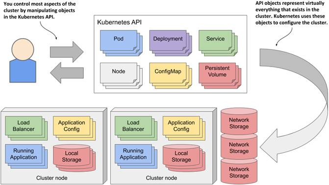

* They include the applications running in the cluster, their configuration, the load balancers through which they are exposed within the cluster or externally, the underlying servers and the storage used by these applications, the security privileges of users and applications, and many other details of the infrastructure.
* The collection of all deployments in the cluster is a REST resource exposed at ##/api/v1/deployments##
* The Kubernetes Control Plane runs several components called controllers that manage the objects you create.
Each controller is usually only responsible for one object type.
For example, the Deployment controller manages Deployment objects.

[source,bash]
----
k get notes
k get node localhost -o yaml
----

* To use API we need expose the api

[source,bash]
----
k proxy
----

=== Running workloads in Pods

.Three basic object types comprising a deployed application
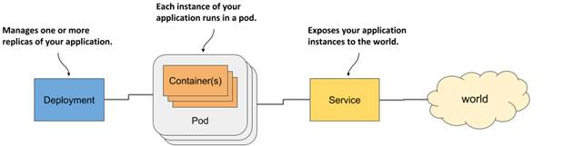

. World ->Service ->Pods <-->Deployment

.Containers in a pod sharing the same Network namespace
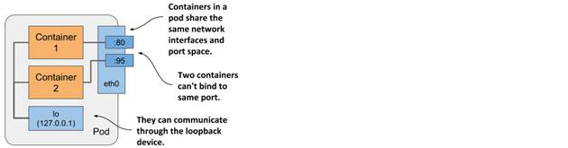

==== Sidecar Containers

. Several containers in a single pod is only appropriate if the application consists of a primary process and one or more processes that complement the operation of the primary process.

.Sidecar Container in the same Pod
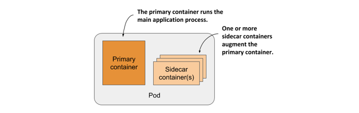

==== How to decide whether to split containers into multiple pods

When deciding whether to use the sidecar pattern and place containers in a single pod, or to place them in separate pods, ask yourself the following questions:

* Do these containers have to run on the same host?
* Do I want to manage them as a single unit?
* Do they form a unified whole instead of being independent components?
* Do they have to be scaled together?
* Can a single node meet their combined resource needs?

.Generating native build
[source,bash]
----
mvn clean compile package -DskipTests -Dnative \
  -Dquarkus.native.container-build=true
#\
#  -Dquarkus.native.builder-image=quarkus/mandrel-2-rhel8:22.3-21
docker build -t app-backend-v1-native -f src/main/docker/Dockerfile.native .
docker tag app-backend-v1-native douglasdb/app-backend-v1-native:1.0
docker push douglasdb/app-backend-v1-native:1.0
k apply -f pod.appbackendv01-ch05.yaml
k get pod app-backendv01-ch05 -n k8s-hells  --template='{{(index (index .spec.containers 0).ports 0).containerPort}}{{"\n"}}'
# Non-ssl scenario
k port-forward app-backendv01-ch05 8080:80
# SSL scenario
k port-forward app-backendv01-ch05-ssl 8080:80 8443 9901
k logs app-backendv01-ch05-ssl -c app-backendv01-ch05-ssl
----

.Create Manifest suing kubectl
[source,bash]
----

k explain pods
k run mypod --image=tag/image:1.0 -dry-run=client -o yaml > mypod.yaml
----

.Sample Pod Running
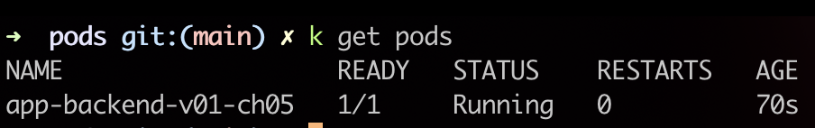

==== Create/Handle Pod Object

[source,bash]
----
k apply -f pod.appbackend.v01-ch05.yaml
k get pod app-backend-v01-ch05
k describe pod app-backend-v01-ch05
k get events -w
k get pod app-backend-v01-ch05 -o wide
k run --image=curlimages/curl -it --restart=Never --rm client-pod curl {{IP_POD}}:8080

k port-forward kiada 8080
k logs kiada
k logs kiada -f
k logs kiada --timestamps=true
# Filtering logs
k logs kiada --since=2m
k logs kiada --since-time=2020-02-01T09:50:00Z
# Reduce total lines
k logs kiada --tail=10
k exec kiada -- ps aux
k exec kiada -- curl -s localhost:8080
k exec kiada curl -s localhost:8080

# Running an interactive shell in the container
k exec -it app-backend-v01-ch05 -- bash
k attach app-backend-v01-ch05

# Note the use of the additional option -i in the command. It instructs kubectl to pass its standard input to the container.
k attach -i kiada-stdin # version two using stdin image
# The kubectl port-forward command can also forward connections to services instead of pods
k port-forward kiada-ssl 8080 8443 990
k logs kiada-ssl -c kiada
k logs kiada-ssl --all-containers
k get pods -w # watch status changing

k delete po kiada
k delete po kiada --wait=false
k delete po --all
k delete po --all
k delete -f pod.kiada.yaml,pod.kiada-ssl.yaml
k delete all --all
# Copying files to and from containers <<Pod
k cp app-backend-v01-ch05:folder/file.html /tmp/index.html
k exec app-backend-v01-ch05 -- ps aux
k exec app-backend-v01-ch05 -- curl -s localhost:8080
----

=== Copying files to and from containers

[source,bash]
----
k cp kiada:html/index.html /tmp/index.html
k cp /tmp/index.html kiada:html/
----

== Sidecar pattern

.Sidecar pattern One Pod Two Containers
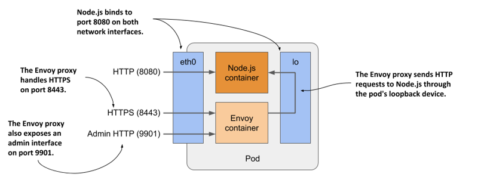

[source,bash]
----
curl https://example.com:8443 --resolve example.com:8443:127.0.0.1 --cacert kiada-ssl-proxy-0.1/example-com.crt
----

== Pod Lifecycles

[source,bash]
----
k get po kiada -o yaml | grep phase
k get pods -n myproject
k describe po kiada
k get po kiada -o json | jq .status.conditions
[{
    "lastProbeTime": null,
    "lastTransitionTime": "2020-02-02T11:42:59Z",
    "status": "True",
    "type": "Initialized"
  }]
k get po kiada -o json | jq .status
k get pods -w
k get events -w
k logs kiada-liveness -c kiada -f
k exec kiada-liveness -c envoy -- tail -f /tmp/envoy.admin.log
curl -X POST localhost:9901/healthcheck/fail
kubectl get po kiada-ssl -o json | jq .status.containerStatuses
----

* restartPolicy - default #_Always_# | #_OnFailure_# | #_Never_#

In a long startup app scenario, you can increase the initialDelaySeconds, periodSeconds or failureThreshold

[source,yaml]
----
  containers:
  - name: kiada
    image: luksa/kiada:0.1
    ports:
    - name: http
      containerPort: 8080
    startupProbe:
      httpGet:
        path: /
        port: http
      periodSeconds: 10
      failureThreshold:  12
    livenessProbe:
      httpGet:
        path: /
        port: http
      periodSeconds: 5
      failureThreshold: 2
----

. Lifecycle hooks, pre-start and pre-stop

== Attaching storage Volumes to Pods

. We've 3 possibilities of volume creation,
.. Container's volume, isolated filesystem
.. Pod's volume can be shared with specific permissions
.. External's volume, cross Pod lifecycles

. When you add a volume to a pod, you must specify the volume type, they are:

.. *empty_dir* The simplest volume type, is a directory that allows the pod to store data for the duration of its life cycle.
.. *hostPath* Used for mounting files from the worker node’s filesystem into the pod
.. *nfs* An NFS share mounted into the pod
.. *gcePersistentDisk, awsElasticBlockStore, azureFile, azureDisk*
.. *configMap, secret, downwardAPI**
.. *persistentVolumeClaim* A portable way to integrate external storage into pods.
Instead of pointing directly to an external storage volume

.Mounting a filesystem into the file tree
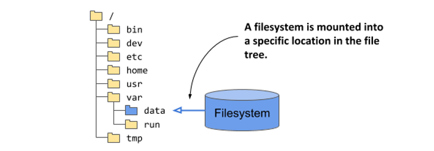

.A volume mounted into more than one container
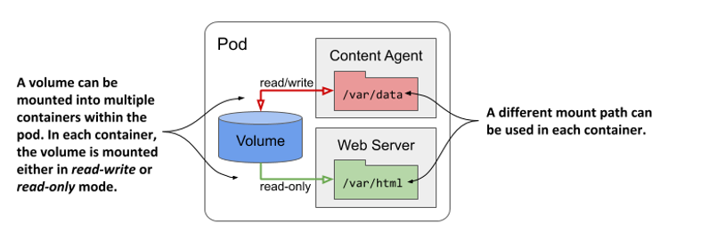

[source,bash]
----
k exec -it quiz -c mongo -- mongo
----

== Persistent Volumes and Claims

. To make pod manifests portable across different clusters envs, we need of an abstract way to claims storage definitions, a _PersistentVolumeClaim_ object connects the pod to this PersistentVolume object

.Persistent Volume Claim
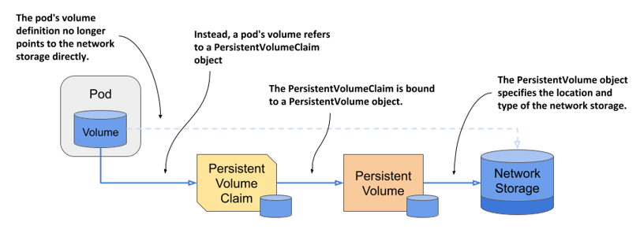

.Reading a crt file in a secret volume
[source,bash]
----
k exec pod-name -c container-name -- cat /etc/certs/example-com.crt
----

== Exposing Pods with Services

.Pods communication
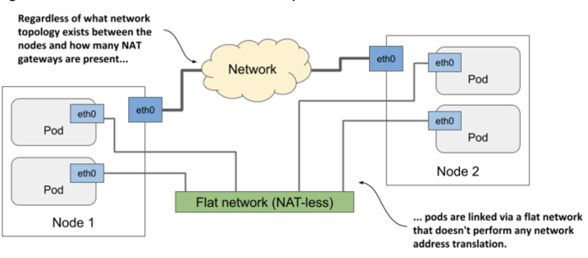

When a pod sends a network packet to another pod, neither SNAT (Source NAT) nor DNAT (Destination NAT) is performed on the packet.
This means that the source IP and port, and the destination IP and port, of packets exchanged directly between pods are never changed.
If the sending pod knows the IP address of the receiving pod, it can send packets to it.
The receiving pod can see the sender’s IP as the source IP address of the packet.

Although there are many Kubernetes network plugins, they must all behave as described above.
Therefore, the communication between two pods is always the same, regardless of whether the pods are running on the same node or on nodes located in different geographic regions.
The containers in the pods can communicate with each other over the flat NAT-less network, like computers on a local area network (LAN) connected to a single network switch.
From the perspective of the applications, the actual network topology between the nodes isn’t important

.Service Object over Pods
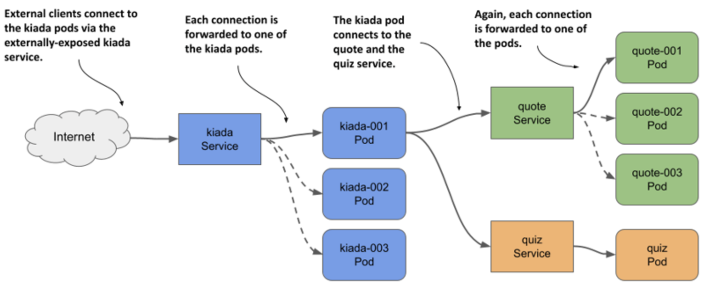

.Flow Service Pods
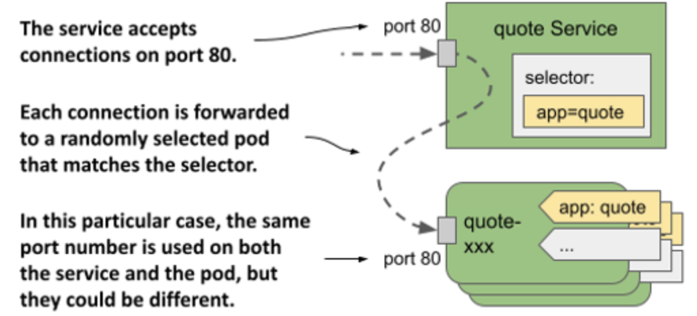

[source,yaml]
----
apiVersion: v1
kind: Service
metadata:
  name: quote
spec:
  type: ClusterIP # Only Cluster Communication
  selector:
    app: quote
  ports:
    - port: 80
      targetPort: 80
      protocol: TCP
----

[source,bash]
----
kubectl get svc -o wide
kubectl set selector service quiz app=quiz
# expose ClusterIP Pod/Service
kubectl exec -it {{pod_name}} -c {{container_name}} -- sh
# expose env vars
kubectl exec -it {{pod_name}} -c {{container_name}} -- env | sort

----

A service is resolvable under the following DNS names:

* <service-name>, if the service is in the same namespace as the pod performing the DNS lookup,
* <service-name>.<service-namespace> from any namespace, but also under
* <service-name>.<service-namespace>.svc, and
* <service-name>.<service-namespace>.svc.cluster.local
