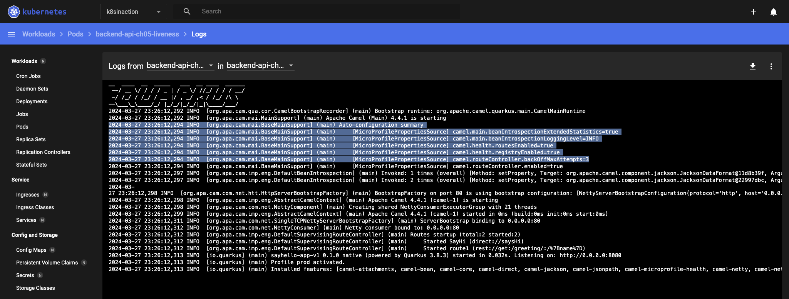
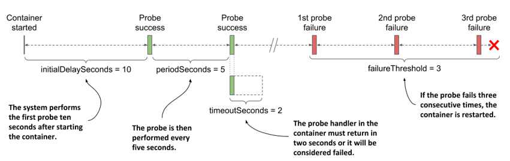
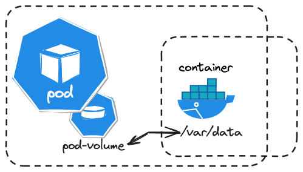
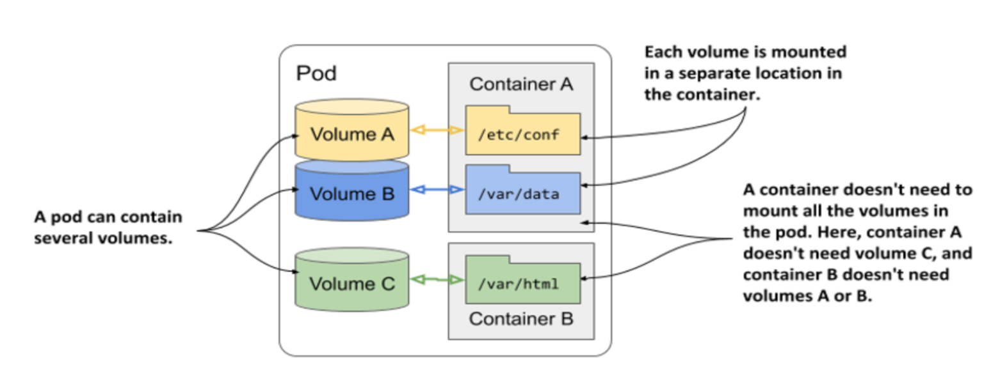
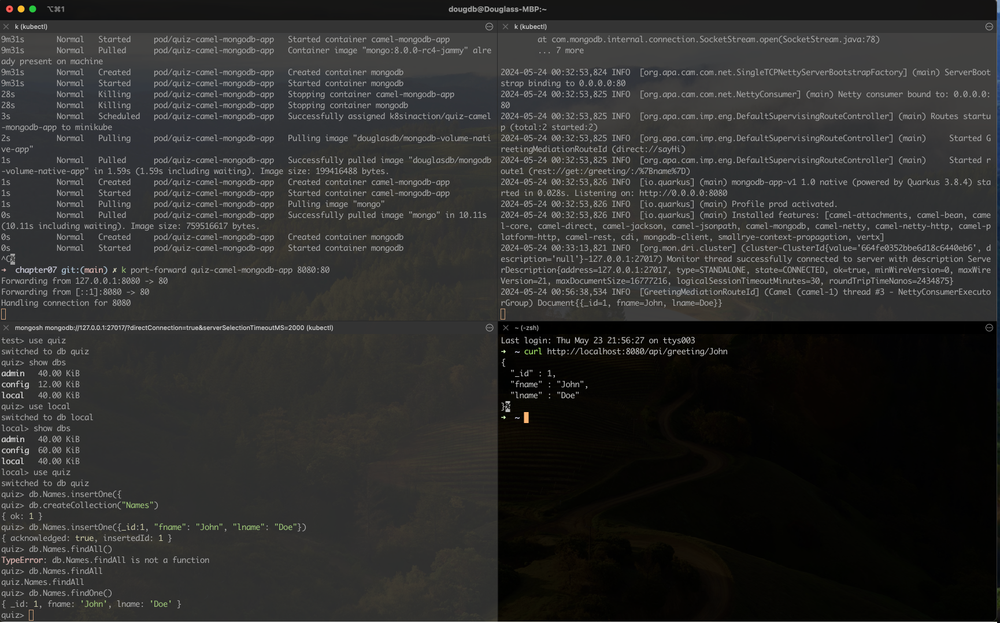
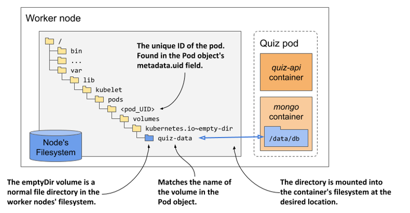

= Kubernetes In Action 2nd

== Links

- https://github.com/luksa/kubernetes-in-action-2nd-edition[Books GitRepo]
- https://camel.apache.org/components/2.x/kubernetes-component.html[Apache Camel Kubernetes API]
- https://github.com/Apress/cloud-native-integration-apache-camel[Cloud Native Integration with Apache Camel Git Source]
- https://stackoverflow.com/questions/62694361/how-to-reference-a-local-volume-in-kind-kubernetes-in-docker[KinD Volumes How-to]
- https://github.com/stacksimplify/aws-eks-kubernetes-masterclass[K8s Masterclass]
- https://github.com/stacksimplify/docker-fundamentals[Docker fundamentals]
- https://github.com/stacksimplify/kubernetes-fundamentals[K8s fundamentals]
- https://kubernetes.io/docs/reference/kubectl/cheatsheet/[kubeclt Cheat Sheet]
- https://github.com/apache/camel-quarkus-examples/tree/main/health[Camel Heath check Registry]
- https://endoflife.date/quarkus-framework[LTS Quarkus versions]

== Minikube Configuration

[source,bash]
----
minikube config set cpus 4
minikube config set memory 8192

minikube start
minikube start --driver=docker --alsologtostderr

minikube addons enable registry
minikube dashboard &
minikube dashboard --url
# or kubens
kubectl create namespace k8s-inaction
kubectl config set-context --current --namespace=k8s-inaction
# get current ns
kubectl config view --minify -o jsonpath='{..namespace}'
kubectl get all,pvc,configmap,rolebindings,clusterrolebindings,secrets,sa,roles,clusterroles,crd -l 'app=my-label'
----

== Minishift OC env Configuration

* OC command in Minishift cluster env is the same kubectl command in K8's cluster

[source,bash]
----
minishift oc-env
eval $(minishift oc-env)
----

[source,bash]
----
brew upgrade minikube
----

'''

=== Introduction Kubernetes API

.A K8s cluster objects
image::../architecture/thumbs/api_k8s_interaction.jpg[]

* They include the applications running in the cluster, their configuration, the load balancers through which they are exposed within the cluster or externally, the underlying servers and the storage used by these applications, the security privileges of users and applications, and many other details of the infrastructure.
* The collection of all deployments in the cluster is a REST resource exposed at ##/api/v1/deployments##
* The Kubernetes Control Plane runs several components called controllers that manage the objects you create.
Each controller is usually only responsible for one object type.
For example, the Deployment controller manages Deployment objects.

[source,bash]
----
k get notes
k get node localhost -o yaml
----

* To use API we need expose the api

[source,bash]
----
k proxy
----

=== Running workloads in Pods

.Three basic object types comprising a deployed application
image::../architecture/thumbs/comprising_deploy_k8s_pod.jpg[]

. World ->Service ->Pods <-->Deployment

.Containers in a pod sharing the same Network namespace
image::../architecture/thumbs/pod_share_same_network_interface.jpg[]

==== Sidecar Containers

. Several containers in a single pod is only appropriate if the application consists of a primary process and one or more processes that complement the operation of the primary process.

.Sidecar Container in the same Pod
image::../architecture/thumbs/sidecar.png[]

==== How to decide whether to split containers into multiple pods

When deciding whether to use the sidecar pattern and place containers in a single pod, or to place them in separate pods, ask yourself the following questions:

* Do these containers have to run on the same host?
* Do I want to manage them as a single unit?
* Do they form a unified whole instead of being independent components?
* Do they have to be scaled together?
* Can a single node meet their combined resource needs?

==== Understanding what Init containers can do

. Initialize files in the volumes used by the pod’s main containers.
This includes retrieving certificates and private keys used by the main container from secure certificate stores, generating config files, downloading data, and so on.

. Initialize the pod’s networking system.
Because all containers of the pod share the same network namespaces, and thus the network interfaces and configuration, any changes made to it by an init container also affect the main container.

. Delay the start of the pod’s main containers until a precondition is met.
For example, if the main container relies on another service being available before the container is started, an init container can block until this service is ready.

. Notify an external service that the pod is about to start running.
In special cases where an external system must be notified when a new instance of the application is started, an init container can be used to deliver this notification.

.Generating native build
[source,bash]
----
mvn clean compile package -DskipTests -Dnative -Dquarkus.native.container-build=true

mvn clean compile package -Pnative -Dquarkus.native.container-build=true -Dquarkus.native.builder-image=quay.io/quarkus/ubi-quarkus-mandrel-builder-image:jdk-21

./mvnw clean compile package -Pnative -Dquarkus.native.container-build=true -Dquarkus.native.builder-image=quay.io/quarkus/ubi-quarkus-mandrel-builder-image:jdk-21

#\
#  -Dquarkus.native.builder-image=quarkus/mandrel-2-rhel8:22.3-21
docker build -t app-backend-v1-native -f src/main/docker/Dockerfile.native .
docker tag app-backend-v1-native douglasdb/app-backend-v1-native:1.0
docker push douglasdb/app-backend-v1-native:1.0
#
k apply -f pod.appbackendv01-ch05.yaml
k get pod app-backendv01-ch05 -n k8s-hells  --template='{{(index (index .spec.containers 0).ports 0).containerPort}}{{"\n"}}'
# Non-ssl scenario
k port-forward app-backendv01-ch05 8080:12080
# SSL scenario
k port-forward app-backendv01-ch05-ssl 8080:80 8443 9901
k logs app-backendv01-ch05-ssl -c app-backendv01-ch05-ssl

k port-forward quiz-camel-mongodb-app 8080:80
----

.Create Manifest suing kubectl
[source,bash]
----

k explain pods
k run mypod --image=tag/image:1.0 -dry-run=client -o yaml > mypod.yaml
----

.Sample Pod Running
image::../architecture/thumbs/pod-running.png[]

==== Create/Handle Pod Object

[source,bash]
----
k apply -f pod.appbackend.v01-ch05.yaml
k get pod app-backend-v01-ch05
k describe pod app-backend-v01-ch05
k get events -w
k get pod app-backend-v01-ch05 -o wide
k run --image=curlimages/curl -it --restart=Never --rm client-pod curl {{IP_POD}}:8080

k port-forward kiada 8080
k logs kiada
k logs kiada -f
k logs kiada --timestamps=true
# Filtering logs
k logs kiada --since=2m
k logs kiada --since-time=2020-02-01T09:50:00Z
# Reduce total lines
k logs kiada --tail=10
k exec kiada -- ps aux
k exec kiada -- curl -s localhost:8080
k exec kiada curl -s localhost:8080

# Running an interactive shell in the container
k exec -it app-backend-v01-ch05 -- bash
k attach app-backend-v01-ch05

# Note the use of the additional option -i in the command. It instructs kubectl to pass its standard input to the container.
k attach -i kiada-stdin # version two using stdin image
# The kubectl port-forward command can also forward connections to services instead of pods
k port-forward kiada-ssl 8080 8443 990
k logs kiada-ssl -c kiada
k logs kiada-ssl --all-containers
k get pods -w # watch status changing

k delete po kiada
k delete po kiada --wait=false
k delete po --all
k delete po --all
k delete -f pod.kiada.yaml,pod.kiada-ssl.yaml
k delete all --all
# Copying files to and from containers <<Pod
k cp app-backend-v01-ch05:folder/file.html /tmp/index.html
k exec app-backend-v01-ch05 -- ps aux
k exec app-backend-v01-ch05 -- curl -s localhost:8080
# 12080
#k port-forward app-backendv01-ch05 8080:12080
k port-forward backend-api-ch05-liveness 8080:80
#
----

.Specific for Native Compilation
[source,shell]
----
➜  ~ curl -v -X GET -H "Content-type: application/json"  http://localhost:8080/api/greeting/douglas
Note: Unnecessary use of -X or --request, GET is already inferred.
*   Trying [::1]:8080...
* Connected to localhost (::1) port 8080
> GET /api/greeting/douglas HTTP/1.1
> Host: localhost:8080
> User-Agent: curl/8.4.0
> Accept: */*
> Content-type: application/json
>
< HTTP/1.1 200 OK
< content-length: 52
< Accept: */*
< name: douglas
< User-Agent: curl/8.4.0
< content-type: application/json
< connection: keep-alive
<
* Connection #0 to host localhost left intact
"Hi douglas we are now in backend-api-ch05-liveness"%
----

=== Copying files to and from containers

[source,bash]
----
k cp kiada:html/index.html /tmp/index.html
k cp /tmp/index.html kiada:html/
----

==== Sidecar pattern

.Sidecar pattern One Pod Two Containers
image::../architecture/thumbs/sidecarpattern.png[]

[source,bash]
----
curl https://example.com:8443 --resolve example.com:8443:127.0.0.1 --cacert kiada-ssl-proxy-0.1/example-com.crt
----

=== Pod Lifecycles

[%header,cols=2*]
|===
|Pod Phase
|Description

|Pending
|After you create the Pod object, this is its initial phase. Until the pod is scheduled to a node and the images of its containers are pulled and started, it remains in this phase.

|Running
|At least one of the pod’s containers is running.
|Succeeded
|Pods that aren’t intended to run indefinitely are marked as Succeeded when all their containers complete successfully.
|Failed
|When a pod is not configured to run indefinitely and at least one of its containers terminates unsuccessfully, the pod is marked as Failed.
|Unknown
|The state of the pod is unknown because the Kubelet has stopped reporting communicating with the API server. Possibly the worker node has failed or has disconnected from the network.
|===

.Managing Pod Lifecycle
[source,bash]
----
k get po app-backendv01-ch05 -o json | jq .status.phase
k get po app-backendv01-ch05 -o json | jq .status.conditions
k get po app-backendv01-ch05 -o json | jq .status.containerStatuses

k get po kiada -o yaml | grep phase
k get pods -n myproject
k describe po kiada
k get po kiada -o json | jq .status.conditions
[{
    "lastProbeTime": null,
    "lastTransitionTime": "2020-02-02T11:42:59Z",
    "status": "True",
    "type": "Initialized"
  }]
k get po kiada -o json | jq .status
k get pods -w
k get events -w
k logs kiada-liveness -c kiada -f
k exec kiada-liveness -c envoy -- tail -f /tmp/envoy.admin.log
curl -X POST localhost:9901/healthcheck/fail
kubectl get po kiada-ssl -o json | jq .status.containerStatuses
----

* If init containers are defined in the pod and one of the pod’s regular containers is restarted, the init containers are not executed again

[%header,cols=2*]
|===
|Restart Policy
|Description
|Always
|Container is restarted regardless of the exit code the process in the container terminates with. This is the default restart policy.
|OnFailure
|The container is restarted only if the process terminates with a non-zero exit code, which by convention indicates failure.
|Never
|The container is never restarted - not even when it fails.
|===

* In a long startup app scenario, you can increase the initialDelaySeconds, periodSeconds or failureThreshold
. Lifecycle hooks, pre-start and pre-stop

* _Post-start_, which are executed when the container starts, and
* _Pre-stop_, which are executed shortly before the container

[source,bash]
----
# in case of Pod take a long time to start, or  can’t be executed or returns a non-zero exit code
# we can looking internal process
k exec pod-name --ps x
k get pods -w
----

WARNING: Using an HTTP GET post-start hook might cause the container to enter an endless restart loop.
Never configure this type of lifecycle hook to target the same container or any other container in the same pod.

.Why doesn’t my application receive the TERM signal?
****

Many developers make the mistake of defining a pre-stop hook just to send a TERM signal to their applications in the pre-stop hook.
They do this when they find that their application never receives the TERM signal.
The root cause is usually not that the signal is never sent, but that it is swallowed by something inside the container.
This typically happens when you use the shell form of the ENTRYPOINT or the CMD directive in your Dockerfile.
Two forms of these directives exist.

The exec form is: `+ENTRYPOINT ["/myexecutable", "1st-arg", "2nd-arg"]+`

The shell form is: `+ENTRYPOINT /myexecutable 1st-arg 2nd-arg+`

When you use the exec form, the executable file is called directly.
The process it starts becomes the root process of the container.
When you use the shell form, a shell runs as the root process, and the shell runs the executable as its child process.
In this case, the shell process is the one that receives the TERM signal.
Unfortunately, it doesn’t pass this signal to the child process.

In such cases, instead of adding a pre-stop hook to send the TERM signal to your app, the correct solution is to use the exec form of ENTRYPOINT or CMD.

Note that the same problem occurs if you use a shell script in your container to run the application.
In this case, you must either intercept and pass signals to the application or use the exec shell command to run the application in your script.
****

[source,bash]
----
kubectl get po <<pod-name>> -o json | jq .status.containerStatuses
----

=== Liveness Probe

* You can specify a liveness probe for each container in the pod, Kubernetes runs the probe periodically to ask the application if it’s still alive and well
* Liveness probes can only be used in the pod’s regular containers.
They can’t be defined in init containers
* _HTTP GET_, _TCP Socket_ and _Exec_ are a possible Probe

.Liveness Probe Sample
[source,yaml]
----
apiVersion: v1
kind: Pod
metadata:
  labels:
    app: backend-api-ch05-liveness
  name: backend-api-ch05-liveness
spec:
  containers:
    - name: backend-api-ch05-liveness
      image: douglasdb/app-backend-v1-native:1.0
      imagePullPolicy: IfNotPresent
      ports:
        - name: http
          containerPort: 12080
      livenessProbe:
        httpGet:
          port: 8080
          path: /q/health
        # the system performs the first probe ten seconds after starting the container
        initialDelaySeconds: 3
        # the probe is then performed every five seconds
        periodSeconds: 3
        # the probe handler in the container must return in two seconds or it be considered failed
        timeoutSeconds: 2
        # if the probe fails three consecutive times, the container is restarted
        failureThreshold: 3
----

* If the application responds with an HTTP status between 200 and 399, the application is considered healthy.

.Configuration and operations of a Liveness Probe

[source,yaml]
----
  containers:
  - name: kiada
    image: luksa/kiada:0.1
    ports:
    - name: http
      containerPort: 8080
    startupProbe:
      httpGet:
        path: /
        port: http
      periodSeconds: 10
      failureThreshold:  12
    livenessProbe:
      httpGet:
        path: /
        port: http
      periodSeconds: 5
      failureThreshold: 2
----

.The only indication that Kubernetes is executing the probe is found in the container logs
[source,bash]
----
k logs kiad-liveness -c kiada -f
# specific log management
k exec kiada-liveness -c envoy -- tail -f /tmp/envoy.admin.log
----

[source,log]
----
$ kubectl describe po kiada-liveness
Name:           kiada-liveness
...
Containers:
  ...
  envoy:
    ...
    State:          Running
      Started:      Sun, 31 May 2020 21:33:13 +0200
    Last State:     Terminated
      Reason:       Completed
      Exit Code:    0
      Started:      Sun, 31 May 2020 21:16:43 +0200
      Finished:     Sun, 31 May 2020 21:33:13 +0200
    ...
----

* When the container defined in the listing starts, the application has 120 seconds to start responding to requests.
Kubernetes performs the startup probe every 10 seconds and makes a maximum of 12 attempts.

[source,yaml]
----
...
  containers:
  - name: kiada
    image: luksa/kiada:0.1
    ports:
    - name: http
      containerPort: 8080
    startupProbe:
      httpGet:
        path: /
        port: http
      periodSeconds: 10
      failureThreshold:  12
    livenessProbe:
      httpGet:
        path: /
        port: http
      periodSeconds: 5
      failureThreshold: 2
----

* The post-start lifecycle hook is invoked immediately after the container is created, we can use the exec type of the hook to execute an additional process as the main process starts, or you can use the httpGet hook to send an HTTP request to the application running in the container to perform some type of initialization or warm-up procedure.

* Although the post-start hook runs asynchronously with the main container process, it affects the container in two ways.
. The container remains in the Waiting state with the reason ContainerCreating until the hook invocation is completed.
. The phase of the pod is Pending.
If you run the kubectl logs command at this point, it refuses to show the logs, even though the container is running.
The kubectl port-forward command also refuses to forward ports to the pod.

[WARNING]
====
Using an HTTP GET post-start hook might cause the container to enter an endless restart loop.
Never configure this type of lifecycle hook to target the same container or any other container in the same pod.
====

== Attaching storage Volumes to Pods

. We've three possibilities of volume creation,
.. Container's volume, isolated filesystem
.. Pod's volume can be shared with specific permissions
.. External's volume, cross Pod lifecycles

. When you add a volume to a pod, you must specify the volume type, they are:

.. *empty_dir* The simplest volume type, is a directory that allows the pod to store data for the duration of its life cycle.
.. *hostPath* Used for mounting files from the worker node’s filesystem into the pod
.. *nfs* An NFS share mounted into the pod
.. *gcePersistentDisk, awsElasticBlockStore, azureFile, azureDisk*
.. *configMap, secret, downwardAPI**
.. *persistentVolumeClaim* A portable way to integrate external storage into pods.
Instead of pointing directly to an external storage volume

.Mounting a filesystem into the file tree
image::../architecture/thumbs/attaching_dir_structure.png[]

.A volume mounted into more than one container
image::../architecture/thumbs/attached_volume_shared.png[]

.Volumes are defined at the pod level and mounted in the pod’s containers

* The lifecycle of a volume is tied to the lifecycle of the entire pod and is independent of the lifecycle of the container in which it is mounted.

* All volumes in a pod are created when the pod is set up—before any of its containers are started.
They are torn down when the pod is shut down.

* Just restarting the container and using the same corrupted files could result in an endless crash loop.

* In pods with more than one container, some volumes can be mounted in some containers but not in others.
This is especially useful when a volume contains sensitive information that should only be accessible to some containers.

.A pod can contain multiple volumes and a container can mount multiple volumes

[source,bash]
----
./mvnw clean compile package -Pnative -Dquarkus.native.container-build=true -Dquarkus.native.builder-image=quay.io/quarkus/ubi-quarkus-mandrel-builder-image:jdk-21
#
docker build -t appv1-emptydir-read -f src/main/docker/Dockerfile.native .
docker build -t appv1-emptydir-write -f src/main/docker/Dockerfile.native .
#
docker tag appv1-emptydir-read douglasdb/appv1-emptydir-read:
docker tag appv1-emptydir-write douglasdb/appv1-emptydir-write:

docker push douglasdb/appv1-emptydir-read:
docker push douglasdb/appv1-emptydir-write:

k apply -f camelapp_pod_quiz_ephemeral.yaml
k port-forward quiz-camel-mongodb-app 8080:80

k exec -it quiz-camel-mongodb-app -c mongodb -- mongosh
test>show dbs
test>use quiz
quiz>db.createCollection("Names")
quiz>db.Names.insertOne({_id:1, "fname": "John": "lname": "Doe"})
#
k exec -it quiz-camel-mongodb-app -c mongodb -- mongosh admin --eval "db.shutdownServer()"
----

=== Available Volume Types

[%header,cols=2*]
|===
|Volume
|Types

|_emptyDir_
|A simple directory that allows the pod to store data for the duration of its life cycle. The directory is created just before the pod starts and is initially empty - hence the name

|_hostPath_
|Used for mounting files from the worker node’s filesystem into the pod.

|_nfs_
|An NFS share mounted into the pod.

|_gcePersistentDisk_
|Google Compute Engine Persistent Disk

|_awsElasticBlockStorage, awsElasticFileStorage_
|AWS Persistent Disk

|_azureFile, azureDisk_
|Used for mounting cloud provider-specific storage.

|_cephfs, cinder, fc, flexVolume, flocker, glusterfs, iscsi, portworxVolume, quobyte, rdb, scaleIO, storageos, photonPersistentDisk, vsphereVolu,e_
|Used for mouting other types of nfs

|_configMap, secretValue, downwardAPI, projected_
|Special types of volumes used to expose information about the pod and other Kubernetes objects through files. They are typically used to configure the application running in the pod

|_persistentVolumeClaim_
|A portable way to integrate external storage into pods. Instead of pointing directly to an external storage volume

|_persistentVolume_
|Object that finally references the actual storage

|_csi_
|A pluggable way of adding storage via the Container Storage Interface. This volume type allows anyone to implement their own storage driver that is then referenced in the csi volume definition
|===

Each volume definition must include a _name_ and a type, which is indicated by the name of the nested field, (for example, emptyDir, gcePersistentDisk, nfs, and so on)

The emptyDir volume type supports two fields for configuring the volume.
They are explained in the following table.

[%header,cols=2*]
|===
|Fields
|Description

|medium
|The type of storage medium to use for the directory. If left empty, the default medium of the host node is used (the directory is created on one of the node’s disks). The only other supported option is Memory, which causes the volume to use tmpfs, a virtual memory filesystem where the files are kept in memory instead of on the hard disk.

|sizeLimit
|The total amount of local storage required for the directory, whether on disk or in memory. For example, to set the maximum size to ten mebibytes, you set this field to 10Mi.

|===

.Kubectl apply two pods, Writer and Watcher
[source,bash]
----
k apply -f writer-watch
----

==== Mouthing a volume in a container

Defining a volume in the pod is only half of what you need to do to make it available in a container.
The volume must also be mounted in the container.
This is done by referencing the volume by name in the volumeMounts array in the container definition.

.Full list of supported fields in a volume mount definition
[%header,cols=2]
|===
|Field
|Description

|name
|The name of the volume to mount. This #must match# one of the volumes defined in the pod.

|mountPath
|The path within the container at which to mount the volume

|readOnly
|Whether to mount the volume as read-only. Default to false

|mountPropagation
|Specifies what should happen if additional filesystem volumes are mounted inside the volume.

Defaults to _None_, which means that the container won’t receive any mounts that are mounted by the host, and the host won’t receive any mounts that are mounted by the container.

_HostToContainer_ means that the container will receive all mounts that are mounted into this volume by the host, but not the other way around.

_Bidirectional_ means that the container will receive mounts added by the host, and the host will receive mounts added by the container.

|subPath
|Defaults to "" which indicates that the entire volume is to be mounted into the container. When set to a non-empty string, only the specified subPath within the volume is mounted into the container.

|subPathExpr
|ust like subPath but can have environment variable references using the syntax $(ENV_VAR_NAME). Only environment variables that are explicitly defined in the container definition are applicable. Implicit variables such as HOSTNAME will not be resolved.

|===

.The files in an emptyDir volume are stored in a directory in the host node’s filesystem

[source, bash]
----
k get po <<pod_name>> -o json | jq .metadata.uid
k get po <<pod_name>> -o json | jq .spec.nodeName
----

== Persistent Volumes and Claims

. To make pod manifests portable across different clusters envs, we need of an abstract way to claims storage definitions, a _PersistentVolumeClaim_ object connects the pod to this PersistentVolume object

.Persistent Volume Claim
image::../architecture/thumbs/pvc.png[]

.Reading a crt file in a secret volume
[source,bash]
----
k exec pod-name -c container-name -- cat /etc/certs/example-com.crt
----

== Exposing Pods with Services

.Pods communication
image::../architecture/thumbs/pods_communications.png[]

When a pod sends a network packet to another pod, neither SNAT (Source NAT) nor DNAT (Destination NAT) is performed on the packet.
This means that the source IP and port, and the destination IP and port, of packets exchanged directly between pods are never changed.
If the sending pod knows the IP address of the receiving pod, it can send packets to it.
The receiving pod can see the sender’s IP as the source IP address of the packet.

Although there are many Kubernetes network plugins, they must all behave as described above.
Therefore, the communication between two pods is always the same, regardless of whether the pods are running on the same node or on nodes located in different geographic regions.
The containers in the pods can communicate with each other over the flat NAT-less network, like computers on a local area network (LAN) connected to a single network switch.
From the perspective of the applications, the actual network topology between the nodes isn’t important

.Service Object over Pods
image::../architecture/thumbs/service_load_balance_over_pods.png[]

.Flow Service Pods
image::../architecture/thumbs/flow-service-pods.png[]

[source,yaml]
----
apiVersion: v1
kind: Service
metadata:
  name: quote
spec:
  type: ClusterIP # Only Cluster Communication
  selector:
    app: quote
  ports:
    - port: 80
      targetPort: 80
      protocol: TCP
----

[source,bash]
----
kubectl get svc -o wide
kubectl set selector service quiz app=quiz
# expose ClusterIP Pod/Service
kubectl exec -it {{pod_name}} -c {{container_name}} -- sh
# expose env vars
kubectl exec -it {{pod_name}} -c {{container_name}} -- env | sort

----

A service is resolvable under the following DNS names:

* <service-name>, if the service is in the same namespace as the pod performing the DNS lookup,
* <service-name>.<service-namespace> from any namespace, but also under
* <service-name>.<service-namespace>.svc, and
* <service-name>.<service-namespace>.svc.cluster.local