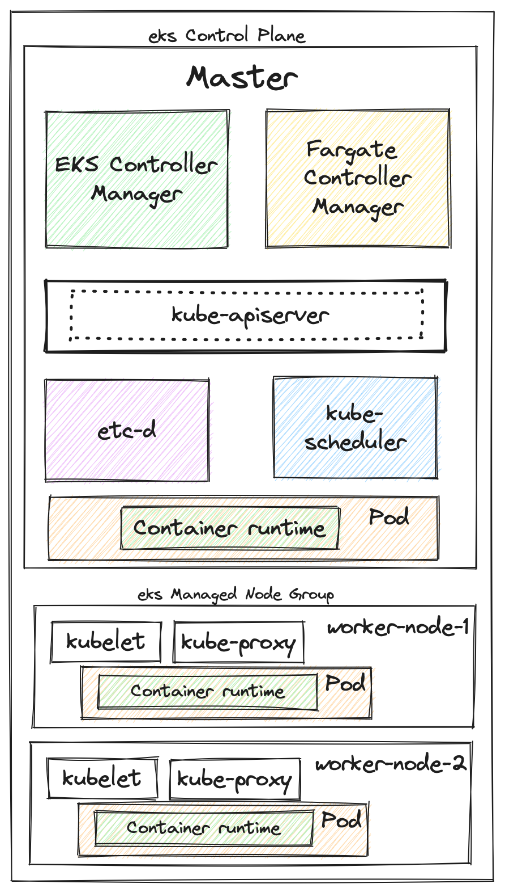
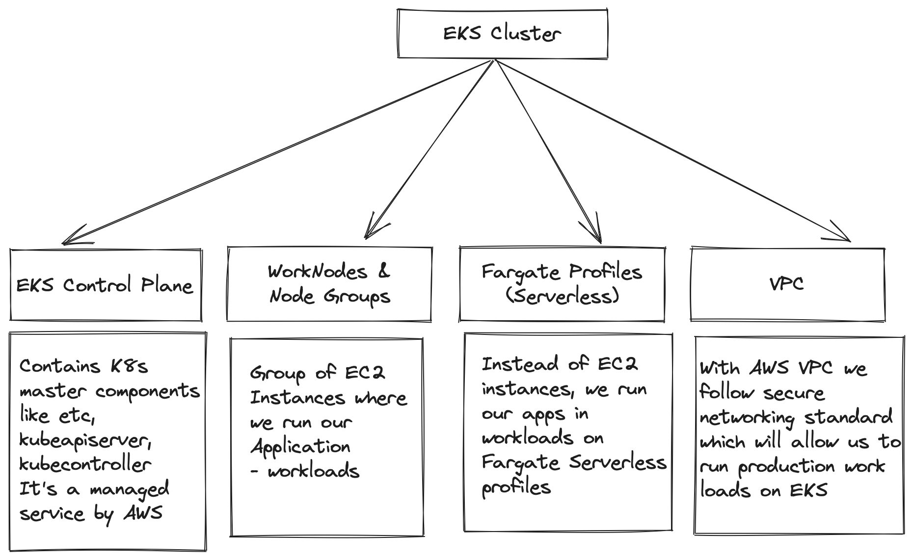
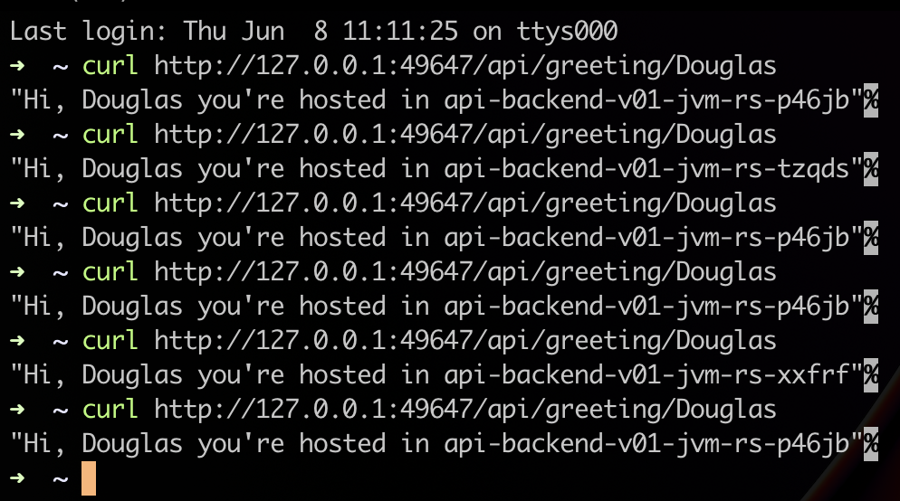
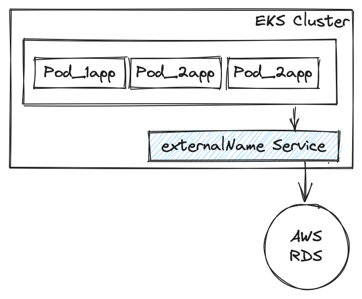
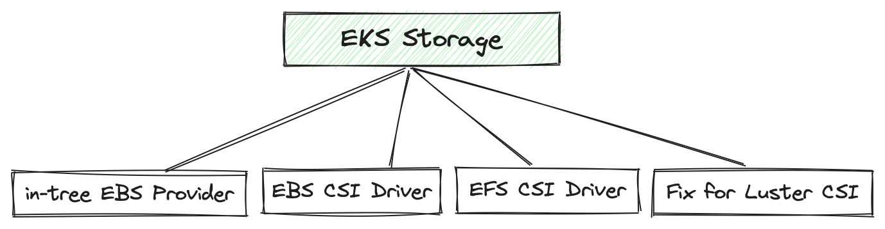
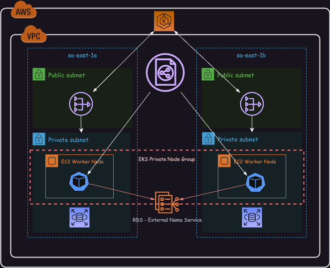
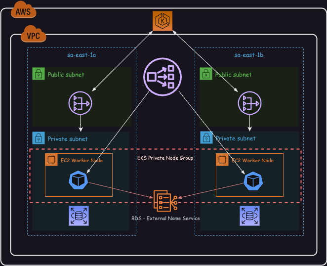

= AWS EKS Kubernetes-Masterclass

== Links

- https://github.com/stacksimplify/aws-eks-kubernetes-masterclass[AWS EKS K8s Masterclass]

== Why K8s

* Portable extensible open-source platform for managing containerized workloads
* Out of the box feats are:
** Service discovery and load balancing
** Storage orchestrations
** Automated rollouts and rollbacks
** Automatic bin packing
** Self-healing
** Secret and configuration management

== Some Core Concepts

* kube-apiserver: acts as _front end_ for the kubernetes control plane, it _exposes_ the Kubernetes api
* CLI tools (like kubectl), users and even Master components _(schedulers, controller manager, etcd)_ and Worker node components like (Kubelet) everything talk with API server
* etcd: consistent and highly-available _key value store_ used as K8s's _backing store_ for all cluster data, it stores all the master and worker node information
* kubelet is an agent that runs on every node and ensures that _containers are running in a Pod_
* kube-proxy apply rules _allow_

.AWS EKS Kubernetes Architecture Overview

== Commands

[source,bash]
----
curl -LO https://storage.googleapis.com/minikube/releases/latest/minikube-darwin-arm64
sudo install minikube-darwin-arm64 /usr/local/bin/minikube
----

.eksctl installation using HomeBrew
[source,bash]
----
brew install eksctl
----

.EKS Cluster Concepts Overview

Obs: All Instances in node group must

****
. Be the same instance type
. Be running the same AMI
. Use the same EKS worker node IAM role
****

* Fargate is a stack that provides _on-demand, right-sized compute capacity_ for containers, with fargate we _no longer_ have to provision, configure or scale groups of virtual machines to run containers; each pod running on Fargate has its _own isolation boundary_ and doesn't share the underlying kernel, CPU resource and memory usages or even network resources with another pod

* EKS uses AWS VPC network policies to restrict traffic between control plane components to within a single cluster, Control Plane cannot view or receive communication from other cluster or other AWS accounts, except as authorized with K8s RBAC policies

.EKSCTL Based on Cloudformation
[source,bash]
----
eksctl create cluster --name=eksdemo1 \
  --region=sa-east-1 \
  --zones=sa-east-1a,sa-east-2b \
  --without-nodegroup
----

* subnets for sa-east-1a - public:IP
* by default {publicAccess=true} API Kube will be public accessible for work nodes and others
* kubeconfig saved in ~/dougdb/.kube/config

.Get cluster name
[source,bash]
----
k get nodes
eksctl get clusters
----

----
No resource found in default namespace will appear at this moment
----

== Create & Associate IAM OIDC

. To enable and use AWS IAM roles for k8s services accounts, we must create & associate OIDC Identity provider

[source,bash]
----
eksctl utils associate-iam-oidc-provider \
  --region sa-east-1 \
  --cluster eksdemo1 \
  --approve
----

.Create NodeGroup with additional add-ons
[source,bash]
----
eksctl create nodegroup --cluster=eksdemo \
  --region=sa-east-1
  --name=eksdemo-appmain
  --node-type=t3.medium
  --nodes=2 \
  --nodes-min=2 \
  --nodes-max=4 \
  --node-volume-size=20 \
  --ssh-access \
  --ssh-public-key=<ssh_key_name_here> \
  --managed \
  --asg-access \
  --external-dns-access \
  --full-ecr-access \
  --appmesh-access \
  --alb-ingress-acess
----

[source,bash]
----
k config view --minify
----

== Kubernetes Fundamentals

=== Pod Commands

.Create Pod using imperative format
[source,bash]
----
k get nodes -o wide
# Create a Pod by Pod instead of Deployment
# API v1.8 isn't necessary
k run helloworld-pod --image <<myimage>> --generator=rud-pod/v1
#
k get pods -o wide
k describe pod <<pod_name>>
k delete <<pod_name>>
----

==== NodePort Concepts

* Kinds Services, _ClusterIP_, _NodePort_, _LoadBalancer_
** ClusterIP only cluster k8s boundary, enable Pods communication, automatically enabled in NodePort routes
** NodePort is exposed by a range of ports (30000–32767) outside k8s cluster, using default communication _http://<worker-node-ip>:<node-port>_
** LoadBalancer vendor specific to expose outside k8s cluster

** Some classifications port service port, _targetPort_ _pod_ port, _nodeport_ work node which we can access the app

[source,bash]
----
k run apibv01-pod --image douglasdb/api-backend-v01-jvm:1.0
k expose pod apibv01-pod --type=NodePort --port=80 --name=apibv01-pod-service
k expose pod apibv01-pod --type=NodePort --port=80 --target-port=81 --name=apibv01-pod-service
k get service
k get svc
k get nodes -o wide

# Minikube context
minikube service apibv01-pod -n k8s-hells --url
#http://127.0.0.1:50304 Mac M1
#❗Because you are using a Docker driver on darwin, the terminal needs to be open to run it.

curl http://127.0.0.1:50304/api/greeting
curl http://127.0.0.1:50304/api/greeting/John
# "Hi, Douglas you're hosted in api-pod"

k get po
k logs -f <<pod_name>>
k exec -it <<pod_name>> -- /bin/bash
k exec -it <<pod_name>> ls
----

==== Replicaset Concepts

* The Main purpose is to maintain a stable set of _replica Pods_ running at any given time, and to avoid overloading of traffic to a single pod, we can use _load balancing_, using out-the-box concept _Services_

.ReplicaSets commands
[source,bash]
----
k get replicaset
k describe rs api-backend-v01-jvm-rs
k expose rs api-backend-v01-jvm-rs --type=NodePort --port=80 --target-port=80 --name=api-backend-v01-jvm-svc
# Minikube context
minikube service api-backend-v01-jvm-svc -n k8s-hells --url
----

.Service as Load Balancer

==== Deployment Concepts

* Superset of Replicaset most commonly used, with feat such as canary, rollout etc

[source,bash]
----
# 1 Pod creation
k create deployment api-backend-v01-jvm-dp --image=douglasdb/api-backend-v01-jvm:1.0
k get deployments
# Scale up replicas
k scale --replicas=20 deployment api-backend-v01-jvm-dp
# Update version v1 to v2, rollout status in rolling updated model
k set images deployment/api-backend-v01-jvm-dp <<container_name>>=<<container_image:new_versionx>> --record=true
k get deploy
k rollout history deployment/<<deployment_name>> --revision=1
k rollout pause deployment/<<deployment_name>>
k rollout resume deployment/<<deployment_name>>
k set resources deployment/<<deployment_name>> -c=<<container_name>> --limits=cpu=200m,memory=50Mi
----

==== Services Concepts

* K8s offer multiple definitions over _"kind of services"_ they are: ClusterIP, NodePort, LoadBalancer, Ingress and externalName
** ClusterIP: commonly used for communication between apps, but only inside k8s cluster, e.g.; front-app communication with back-app
** NodePort: commonly used for give up access outside k8s cluster using _Work Node Ports_, e.g:; access front-app in a public internet
** LoadBalancer: commonly used in _Cloud Providers_ _(AWS NLB, ALB)_, minikube doesn't support this feat, it enables internal integration with Cloud Provider Load Balancer service
** Ingress: commonly used for advanced scenarios using load balancer concepts and adding _Context Path_ based on routing with _SSL_, _SSL Redirect_ and much more
** externalName: commonly used for scenarios where applications need external access for apps hosted e.g.:; Access AWS RDS endpoint by app present inside k8s

.EKS externalName Service Concept

[source,bash]
----
k create deployment backend-app-dp \
  --image=stacksimplify/kube-hello-world:1.0.0
k get logs -f <<pod_name>
k get deploy

# Default type is ClusterIP
k exposes deployment backend-app-dp --port=8080 --target-port=8080 \
  --name=backend-app-svc
k get svc
----

.Sample of NGINX Conf
[source,html]
----
server {
    listen 80;
    server_name localhost;
    location / {
        # Update your backend app...
        proxy_pass http://<<service_name>><<ns-full-dns>>:<<port>>;
    }
    error_page 500 502 503 504 /50x.html;
    location = /50x.html {
        root /usr/share/nginx/html;
    }
}
----

== EKS Block Storage Types

.EKS Block Storage Types

* in-Tree Legacy
* EBS/EFS/FSx CSi Driver Container Storage interface, with k8s 1.14 & later, FSx k8s 1.16 & later

* AWS Fargate no support persistent storage

* EBS provides block level storage volumes for use with Ec2 & Container instances, mounted these volumes as devices attached to an instance that are exposed as storage volumes that persist independently of lif Ec2 or Container, and most we can dynamically change the configuration of a volume attached to an instance

=== Install EBS CSI Driver Steps

. Create IAM Policy
. Associate IAM Policy to Worknode IAM Role
. Install EVS CSI Driver

////
* Implementation Details

Review Policy
Name: * EBS_CSI_Driver_EKS_v01
Description: Empty

////

.IAM Policy to EC2 Association K8s v1.14 or later
[source,json]
----
{
  "Version": "2012-10-17",
  "Statement": [
    {
      "Effect": "Allow",
      "Action": [
        "ec2:AttachVolume",
        "ec2:CreateSnapshot",
        "ec2:CreateTags",
        "ec2:CreateVolume",
        "ec2:DeleteSnapshot",
        "ec2:DeleteTags",
        "ec2:DeleteVolume",
        "ec2:DescribeInstances",
        "ec2:DescribeSnapshots",
        "ec2:DescribeTags",
        "ec2:DescribeVolumes",
        "ec2:DetachVolumes"
      ],
      "Resource": "*"
    }
  ]
}
----

.Get IAM role Worker Nodes
[source,bash]
----
kubectl -n kube-system describe configmap aws-auth
# rolearn: arn:aws:iam::xxxx/ekstctl-xxxx
kubectl apply -k "github.com/kubernetes-sigs/aws-ebs-csi-driver/deploy/kubernetes/overlays/stable/?ref=master"
kubectl get pods -n kube-system
# ebs-csi-controller-xxx
# user-mgmt folder after all manifests created
kubectl apply -f user-mgmt/
kubeclt get cm
kubeclt get pv
kubectl get sc
kubectl get pvc
# Applying all the changes again
kubectl apply -f user-mgmt/
kubectl get pods -l app=mysql
# Connect to MYSQL Database over the Pod
kubectl run -it --rm --image=mysql:5.6 --restart=Never mysql-client -- mysql -h mysql -root_Pwd
> msql show schemas
#
kubectl get sc,pvc,pv
k get all --namespace kube-system
# Connect over RDS into EKS using kubectl
kubeclt run -it --rm --image=mysql:5.7.22 --restart=Never mysql-client -- mysql -h host.rds.mysql -u user -pdbpassword
----

[source,bash]
----
echo -n 'welcome1' | base64
----

== Probes

* K8s uses *liveness probe* to know when to restart a container
* K8s uses *readiness probe* to know when a container is ready to accept traffic
* K8s uses *startup probe* to know when a container application has started
* Options for probes are: command, httpGet, tpc*

.Probes Sample
[source,yaml]
----
livenessProbe:
  exec:
    command:
    - /bin/sh
    - -c
    - nc -z localhost 8095
  initialDelaySeconds: 60
  periodSeconds: 10
---
readinessProbe:
  httpGet:
    path: /myservice/health-status
    port: 8095
  initialDelaySeconds: 60
  periodSeconds: 10
----

[source,bash]
----
k get nodes
k describe node <<node>>

----

.Classic Load Balance Communication Architecture

.Create Private NodeGroup
[source,bash]
----
eksctl get nodegroup --cluster=cluster-name
eksctl delete nodegroup nodegroup-name --cluster cluster-name
#
eksctl create node-group --cluster=eksdemo1 \
  --region=sa-east-1 \
  --name=eksdemo1-ng-private-1
  --node-type=t3.medium \
  --nodes-min=2 \
  --nodes-max=4 \
  --node-volume-size=20 \
  --ssh-access \
  --ssh-public-key=key-demo \
  --managed \
  --asg-access \
  --external-dns-access \
  --full-ecr-access \
  --appmesh-access \
  --node-private-networking # private Node Group, no public-ip

kubectl get nodes -o wide
----

.Network Load Balance Communication Architecture

